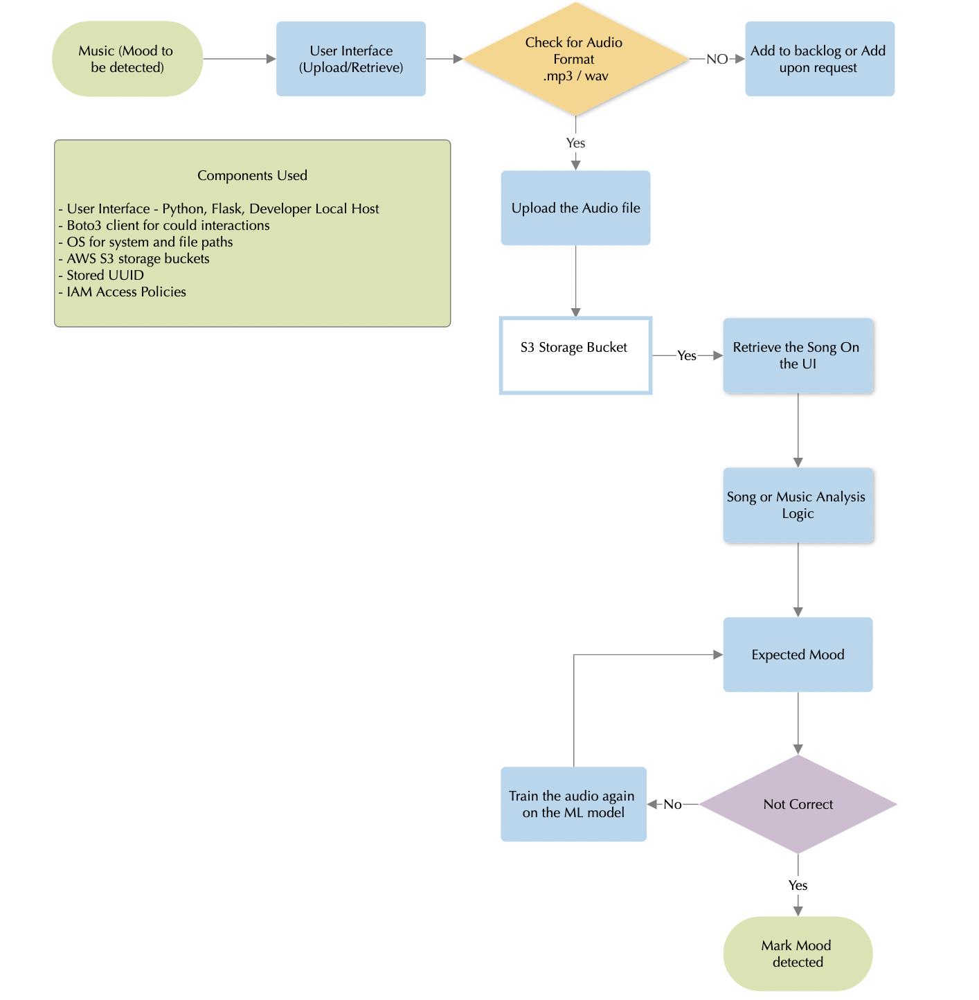

# WavelyDx
Wavely Backend Engineer assessment

Build a Mood detection service from audio files. The goal is to build two services:

- Service to store an audio file in a cloud storage like Azure Blob Store.
- Service to retrieve the mood from the input audio file provided above.

## The System Design or The architecture 

let's break down the System design and code in more detail:

1. **AWS S3 Configuration:**
   - The code configures the Flask app to interact with AWS S3 for file storage.
   - It uses the `boto3` library, the AWS SDK for Python, to create an S3 client with provided access key, secret key, and region.

2. **Flask Routes:**
   - **`/` Route:**
      - Responds to HTTP GET requests.
      - Renders the `index.html` template, which is presumably a webpage displaying the main page of the application.

   - **`/upload` Route:**
      - Responds to HTTP POST requests.
      - Handles file uploads submitted through a form.
      - Checks if a file is present in the request. If not, it redirects to the current URL.
      - Saves the uploaded file locally in the 'tmp' directory.
      - Uploads the file to the specified AWS S3 bucket using the `upload_to_s3` function.
      - Deletes the local copy of the file.
      - Redirects to the `/` route after the upload.

3. **S3 Interaction Functions:**
   - **`upload_to_s3`:**
      - Takes a local file path, S3 bucket name, and S3 client as parameters.
      - Generates a unique filename using a UUID and the '.mp3' extension.
      - Uploads the file to the specified S3 bucket with the generated filename.
      - Returns the generated filename.

   - **`get_from_s3`:**
      - Takes a file name, S3 bucket name, and S3 client as parameters.
      - Downloads the specified file from S3 to a local temporary directory ('tmp').
      - Returns the local file path.

   - **`get_uploaded_files`:**
      - Takes a S3 bucket name and S3 client as parameters.
      - Lists objects (files) in the S3 bucket.
      - Returns a sorted list of files based on their last modified times, with the most recent file first.

4. **Mood Detection:**
   - The `detect_mood` function is a placeholder for a mood detection algorithm.
   - Currently, it returns a random mood from a predefined list ('Happy', 'Sad', 'Calm').

5. **HTML Templates:**
   - There is at least one HTML template (`index.html`) used for rendering the main page of the application.
   - The template is likely to contain the form for file uploads.

6. **Flask App Execution:**
   - The `if __name__ == '__main__':` block ensures that the Flask app is run when the script is executed directly.
   - It runs the app in debug mode, which provides helpful debugging information.

Overall, this Flask app allows users to upload audio files, stores them on AWS S3, and incorporates a basic placeholder for mood detection. The code structure follows typical Flask patterns for handling routes, file uploads, and interaction with an external storage service (S3).

## The Landing page
- This is the local host using flask

## Song Upload page
- Selection of the song to be uploaded

## S3 Bucket Storage Container 
- Storing the song/audio file by creating a UUID for avoiding repeats

## Retrieve Mood
- Random logic to retrieve mood

